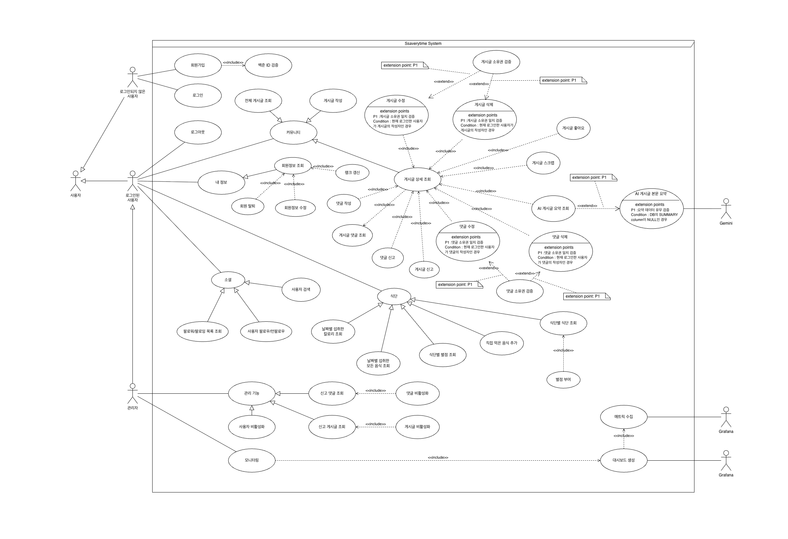

  
  
  # SsaveryTime (싸브리타임)
  
  **"싸피인들의 소중한 시간을 아껴드립니다."**
   
  삼성 청년 SW 아카데미(SSAFY) 교육생들을 위한 통합 정보 공유 및 커뮤니티 플랫폼
   

---

## Tech Stack

### Frontend

### Backend

### AI & Data

### DevOps & Monitoring

---

## Architecture

### System Architecture

  

 

**시스템 아키텍처 (System Architecture)**
 
Vue.js 프론트엔드, Spring Boot 백엔드, FastAPI AI 서비스, 그리고 MySQL 데이터베이스로 구성된 전체 시스템 구조입니다. AWS EC2 상에서 Docker Compose를 통해 모든 서비스와 모니터링 도구(Prometheus, Grafana)가 유기적으로 연결되어 동작하는 배포 환경을 보여줍니다.

*   **Frontend:** Vue 3 + Vite 기반의 SPA. EC2 내에서 Docker 컨테이너로 실행됩니다.
*   **Backend:** Spring Boot API 서버. RESTful API를 제공하며 MySQL RDS와 통신합니다.
*   **AI Service:** Python FastAPI로 구축된 마이크로서비스. 게시글 요약 기능을 담당합니다.
*   **Infra:** AWS EC2 인스턴스 하나에 Docker Compose를 이용하여 모든 서비스(FE, BE, AI, Monitoring)를 오케스트레이션합니다.
*   **Monitoring:** Prometheus가 Spring Boot Actuator 메트릭을 수집하고, Grafana를 통해 시각화합니다.

### Usecase Diagram

  

 

**유스케이스 다이어그램 (Usecase Diagram)**
 
사용자(교육생)와 관리자가 시스템과 상호작용하는 주요 기능을 정의합니다. 게시글 작성, 식단 조회, 프로필 관리, AI 요약 요청 등 사용자가 플랫폼을 통해 수행할 수 있는 핵심 활동과 범위를 시각화했습니다.

### Class Diagram

  

 

**클래스 다이어그램 (Class Diagram)**
 
백엔드 애플리케이션의 핵심 클래스 구조를 나타냅니다. Controller, Service, Repository, Entity 계층 간의 의존 관계와 데이터 흐름을 정의하며, 객체 지향 설계 원칙에 따른 시스템의 정적 구조를 보여줍니다.

### ER Diagram

  

 

**ER 다이어그램 (ER Diagram)**
 
MySQL 데이터베이스의 스키마 설계를 보여줍니다. 사용자(User), 게시글(Board), 댓글(Comment), 식단(Diet) 등 주요 엔티티 간의 관계(1:N, N:M 등)와 데이터 구조를 상세히 기술하여 데이터 무결성과 흐름을 파악할 수 있습니다.

---

## Key Features

1.  **게시판 & 커뮤니티:** 익명/실명 게시글 작성, 댓글, 좋아요, 스크랩 기능.
2.  **알고리즘 랭크 연동:** Solved.ac와 연동하여 사용자의 백준 티어 정보를 실시간으로 프로필과 게시글에 표시합니다.
3.  **AI 게시글 요약:** 긴 게시글 내용을 AI(GPT-4o mini)가 3줄로 요약해줍니다.
4.  **식단 정보:** SSAFY 캠퍼스별 식단 정보를 제공합니다.
5.  **반응형 UI:** 데스크탑과 모바일 환경 모두에 최적화된 사용자 경험을 제공합니다.

---

## Team

| 이름 | 학번 | 역할 |
| :---: | :---: | :--- |
| **박형주** | 1412288 | **UI / Backend / AI / DevOps** - Spring Boot API 개발 - AWS EC2 & RDS 배포 - Docker & Monitoring 구축 - AI 분산 서버 구축 
| **심동근** | 1415822 | **Database / Backend / UI** - Vue 3 화면 설계 및 구현 - Shadcn UI 디자인 시스템 적용 - Spring Boot API 개발 - API 연동 - Solved.ac 연동 | |

---
