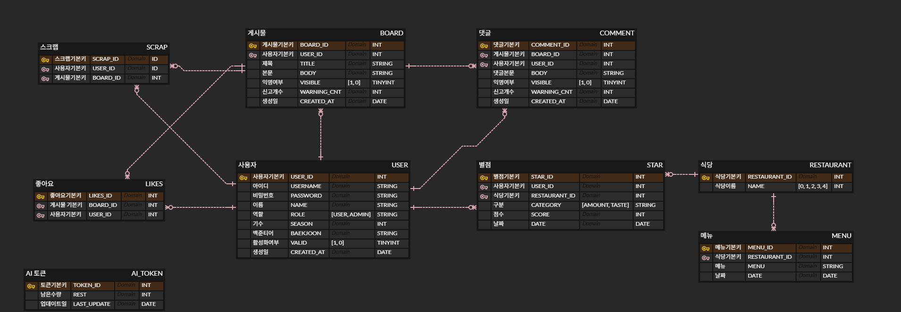

# ssaveryTime Database

## ERD (Entity-Relationship Diagram)

## Database Schema

### `USER`

사용자 정보를 저장하는 테이블

| Column | Type | Description |
|---|---|---|
| `USER_ID` | INT | 사용자 고유 ID (PK) |
| `USERNAME` | VARCHAR(255) | 사용자 아이디 (UNIQUE) |
| `PASSWORD` | VARCHAR(255) | 사용자 비밀번호 |
| `NAME` | VARCHAR(100) | 사용자 이름 |
| `ROLE` | ENUM('USER', 'ADMIN') | 사용자 역할 (기본값: 'USER') |
| `SEASON` | INT | 사용자 기수 |
| `BAEKJOON` | VARCHAR(100) | 백준 아이디 |
| `VALID` | ENUM('1', '0') | 계정 활성화 여부 |
| `CREATED_AT` | DATETIME | 계정 생성일 |

### `BOARD`

게시글 정보를 저장하는 테이블

| Column | Type | Description |
|---|---|---|
| `BOARD_ID` | INT | 게시글 고유 ID (PK) |
| `USER_ID` | INT | 작성자 ID (FK) |
| `TITLE` | VARCHAR(255) | 게시글 제목 |
| `BODY` | TEXT | 게시글 내용 |
| `VISIBLE` | ENUM('1', '0') | 게시글 공개 여부 (기본값: '1') |
| `WARNING_CNT` | INT | 경고 횟수 (기본값: 0) |
| `CREATED_AT` | DATETIME | 게시글 작성일 |

### `COMMENT`

댓글 정보를 저장하는 테이블

| Column | Type | Description |
|---|---|---|
| `COMMENT_ID` | INT | 댓글 고유 ID (PK) |
| `BOARD_ID` | INT | 게시글 ID (FK) |
| `USER_ID` | INT | 작성자 ID (FK) |
| `BODY` | VARCHAR(500) | 댓글 내용 |
| `VISIBLE` | ENUM('1', '0') | 댓글 공개 여부 (기본값: '1') |
| `WARNING_CNT` | INT | 경고 횟수 (기본값: 0) |
| `CREATED_AT` | DATETIME | 댓글 작성일 |

### `LIKES`

게시글 좋아요 정보를 저장하는 테이블

| Column | Type | Description |
|---|---|---|
| `LIKES_ID` | INT | 좋아요 고유 ID (PK) |
| `BOARD_ID` | INT | 게시글 ID (FK) |
| `USER_ID` | INT | 사용자 ID (FK) |

### `SCRAP`

게시글 스크랩 정보를 저장하는 테이블

| Column | Type | Description |
|---|---|---|
| `SCRAP_ID` | INT | 스크랩 고유 ID (PK) |
| `USER_ID` | INT | 사용자 ID (FK) |
| `BOARD_ID` | INT | 게시글 ID (FK) |

### `AI_TOKEN`

AI 토큰 정보를 저장하는 테이블

| Column | Type | Description |
|---|---|---|
| `TOKEN_ID` | INT | 토큰 고유 ID (PK) |
| `REST` | INT | 남은 토큰 수 (기본값: 0) |
| `LAST_UPDATE` | DATETIME | 마지막 업데이트 시간 |

### `RESTAURANT`

식당 정보를 저장하는 테이블

| Column | Type | Description |
|---|---|---|
| `RESTAURANT_ID` | INT | 식당 고유 ID (PK) |
| `NAME` | VARCHAR(255) | 식당 이름 |

### `MENU`

메뉴 정보를 저장하는 테이블

| Column | Type | Description |
|---|---|---|
| `MENU_ID` | INT | 메뉴 고유 ID (PK) |
| `RESTAURANT_ID` | INT | 식당 ID (FK) |
| `MENU` | VARCHAR(255) | 메뉴 이름 |
| `DATE` | DATETIME | 날짜 |

### `STAR`

별점 정보를 저장하는 테이블

| Column | Type | Description |
|---|---|---|
| `STAR_ID` | INT | 별점 고유 ID (PK) |
| `USER_ID` | INT | 사용자 ID (FK) |
| `RESTAURANT_ID` | INT | 식당 ID (FK) |
| `CATEGORY` | ENUM('TASTE', 'AMOUNT') | 별점 카테고리 |
| `SCORE` | INT | 점수 |
| `DATE` | DATETIME | 별점 등록일 |
